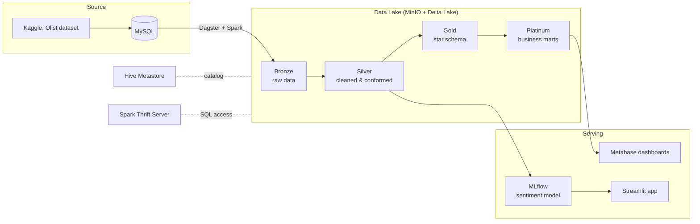

# Data Lakehouse on the Olist E-Commerce Dataset

An end-to-end, fully containerized **Data Lakehouse**: raw operational data is ingested from MySQL into a MinIO-backed Delta Lake, refined through a Medallion architecture (Bronze → Silver → Gold → Platinum) with Spark orchestrated by Dagster, analyzed in Metabase, and served through an ML-powered Streamlit app (sentiment analysis on customer reviews, tracked with MLflow).

## Architecture



**Stack:** Dagster (orchestration) · Apache Spark 3.3 (processing) · Delta Lake (ACID table format) · MinIO (object storage) · Hive Metastore (catalog) · **Trino** (interactive SQL) · **Kafka + Debezium** (CDC streaming from MySQL) · **dbt** (SQL transformations on Trino) · MySQL (source system) · Metabase (BI) · MLflow (experiment tracking) · Streamlit (app) · Docker Compose (infrastructure)

## Medallion layers & loading strategy

| Layer | Content | Write strategy |
|---|---|---|
| Bronze | Raw data, exactly as extracted from MySQL | `append` — never mutate the source of truth |
| Silver | Cleaned, validated, schema-conformed tables | `overwrite` — rebuilt from Bronze each run |
| Gold | Star schema: dimensions + fact table | `upsert` — update existing keys, insert new ones |
| Platinum | Aggregated business marts (sales cube) | `upsert` |

All lake tables are stored as **Delta/Parquet** on MinIO.

## Quick start

Prerequisites: Docker with ~8 GB RAM available.

```bash
# 1. Configure environment (defaults work out of the box for local dev)
cp env.example .env

# 2. Start the platform
docker compose up -d --build

# 3. Load the Olist dataset into MySQL (source system simulation)
make mysql_create
make mysql_load
```

Then open the **Dagster UI at http://localhost:3001** and materialize the assets (Bronze → Silver → Gold → Platinum → ML).

### Service endpoints

| Service | URL / port |
|---|---|
| Dagster (orchestrator UI) | http://localhost:3001 |
| MinIO console | http://localhost:9001 (minio / minio123) |
| Trino (SQL engine) | http://localhost:8082 |
| Metabase (BI) | http://localhost:3000 |
| MLflow | http://localhost:7893 |
| Streamlit app | http://localhost:8501 |
| Jupyter (Spark notebook) | http://localhost:8888 |
| Spark master UI | http://localhost:8081 |
| Spark Thrift Server (JDBC) | localhost:10000 |
| Debezium Connect (REST) | http://localhost:8083 |
| Kafka broker | kafka:9092 (inside the compose network) |
| MySQL (source) | localhost:3307 |

## Interactive SQL with Trino

Trino queries every Delta table in the lake through the shared Hive Metastore — no Spark job needed:

```bash
make to_trino
# trino> SELECT * FROM gold.fact_table LIMIT 10;
# trino> SHOW SCHEMAS;   -- bronze, silver, gold, platinum
```

The `lakehouse` catalog is configured in [docker_image/trino/catalog/lakehouse.properties](docker_image/trino/catalog/lakehouse.properties).

## CDC streaming with Kafka + Debezium

Debezium tails the MySQL binlog and streams every insert/update/delete on the `olist` database into Kafka topics (`olist.olist.<table>`):

```bash
# Register the connector (once, after the stack is up)
make register_cdc
make cdc_status

# Watch change events
docker exec kafka /opt/kafka/bin/kafka-console-consumer.sh \
  --bootstrap-server kafka:9092 --topic olist.olist.orders --from-beginning
```

Connector config lives in [cdc/register-mysql-connector.json](cdc/register-mysql-connector.json).

### Streaming CDC into Bronze

Two Spark Structured Streaming jobs move changes into the lake with exactly-once delivery (checkpoints on MinIO):

```bash
make stream_cdc          # raw events -> append-only Delta table bronze.cdc_events
make stream_cdc_tables   # parse payload.after per source table -> bronze.cdc_<table> (typed, schema drift merged)
```

## dbt transformations

The [dbt/](dbt/) project builds Platinum-layer marts on Trino from the Gold star schema (`monthly_revenue`, `revenue_by_category`), with schema tests:

```bash
make dbt_build   # runs dbt build (models + tests) against Trino
```

## Machine learning

Customer review comments (Portuguese) from the Silver layer are cleaned, vectorized with TF-IDF, and classified as positive/negative with Logistic Regression. Runs are tracked in MLflow with artifacts stored on MinIO.

Current model performance on the held-out test set (8,196 reviews):

| | precision | recall | f1 |
|---|---|---|---|
| negative | 0.87 | 0.84 | 0.85 |
| positive | 0.91 | 0.93 | 0.92 |
| **accuracy** | | | **0.90** |

The Streamlit app serves the model: browse reviews, predict sentiment for new comments, and chat with the data.

## Project structure

```
├── docker-compose.yaml        # All 16 services
├── docker_image/              # Custom images & config (Spark, Dagster, MLflow, Streamlit, Hive Metastore, Trino)
├── etl_pipeline/              # Dagster code location
│   └── etl_pipeline/
│       ├── assets/            # bronze / silver / gold / platinum / ml / eda assets
│       └── resources/         # MySQL, MinIO, Spark IO managers
├── dbt/                       # dbt project: Platinum marts on Trino
├── cdc/                       # Debezium MySQL connector config
├── app/                       # Streamlit multi-page app
├── dataset/                   # Olist CSV files (loaded into MySQL)
├── load_dataset_into_mysql/   # SQL bootstrap scripts
└── Makefile                   # DB loading / Trino / CDC / dbt shortcuts
```

## Dataset

[Brazilian E-Commerce Public Dataset by Olist](https://www.kaggle.com/datasets/olistbr/brazilian-ecommerce) — ~100k orders (2016–2018) across 9 relational tables: orders, order items, payments, reviews, customers, sellers, products, geolocation, and category translations.

The CSVs are **not committed to the repo** (~120MB, gitignored). Download the dataset from Kaggle and extract the 9 CSVs into `DataLake/dataset/` before running `make mysql_load`.

## Roadmap

- [x] Trino for interactive SQL over the lake
- [x] CDC streaming ingestion from MySQL (Debezium + Kafka)
- [x] dbt models for the Platinum layer (on Trino)
- [x] Spark Structured Streaming: CDC topics → Bronze Delta table
- [x] Data quality: Dagster asset checks + unit tests in CI
- [x] Parse raw CDC events into typed Bronze tables
- [ ] Incremental Silver refresh from CDC tables
- [ ] Deploy to cloud free tier with Terraform

## Author

**Tào Việt Đức** — [@taovietducofficial](https://github.com/taovietducofficial) · taovietduc.work@gmail.com

Originally built as my university thesis project, then developed further: repository cleanup and CI, Trino integration, Kafka + Debezium CDC streaming, and the dbt layer, with the roadmap above in progress.

## License

Proprietary — all rights reserved. See [LICENSE](../LICENSE).
