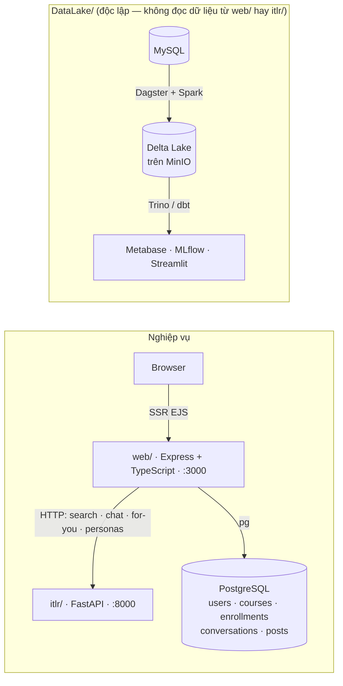

<div align="center">

# IT Learning Recommender System

**Hybrid Recommender System · RAG Chatbot · Data Lakehouse · Full-Stack Engineering Portfolio**

[](itlr)
[](itlr/api)
[](web)
[](web/src/db)
[](docker-compose.yml)
[](DataLake)
[](.github/workflows)
[](LICENSE)

Hệ thống gợi ý khóa học & tài liệu học tập CNTT bằng tiếng Việt — dự án full-stack production-grade
kết hợp Recommender System, chatbot RAG đa intent, web app nghiệp vụ đầy đủ, một Data Lakehouse
độc lập, và pipeline CI/CD hoàn chỉnh — toàn bộ được đo đạc bằng một khung đánh giá khoa học dùng
metric chuẩn ngành thay vì cảm tính.

</div>

<br>

| Chỉ số | Kết quả |
|---|---|
| Collaborative Filtering vs popularity baseline | HitRate@10 **0.611 vs 0.043** (×14) |
| Learning-to-Rank vs Cross-Encoder rerank | Cùng chất lượng, nhanh hơn **~74×** khi serving |
| Cổng off-topic của chatbot | AUC (ROC) **0.99** |
| Off-policy evaluation (SNIPS/DR) | CI 95% phủ đúng giá trị thật, naive lệch **−0.076** |
| DataLake — phân loại cảm xúc review | Accuracy **0.90** trên 8.196 review giữ lại kiểm thử |

<br>

## Mục lục

- [Vì sao dự án này thể hiện năng lực Full-Stack Software Engineer](#vì-sao-dự-án-này-thể-hiện-năng-lực-full-stack-software-engineer)
- [Kiến trúc](#kiến-trúc)
- [Tech stack](#tech-stack)
- [Cấu trúc thư mục](#cấu-trúc-thư-mục)
- [Cách chạy](#cách-chạy)
- [Thuật toán](#thuật-toán)
- [Đánh giá khoa học](#đánh-giá-khoa-học)
- [Data Engineering — DataLake](#data-engineering--datalake)
- [CI/CD](#cicd)
- [Tác giả](#tác-giả)
- [Giấy phép](#giấy-phép)

---

## Vì sao dự án này thể hiện năng lực Full-Stack Software Engineer

| Mảng | Thể hiện trong dự án |
|---|---|
| **Backend / API** | FastAPI, kiến trúc phễu xếp hạng 4 tầng bật/tắt độc lập, hybrid scoring, thiết kế module tách bạch (`core`/`chatbot`/`eval`/`pipelines`) |
| **Web full-stack** | Express + TypeScript SSR (EJS), PostgreSQL, auth JWT httpOnly, realtime qua SSE, middleware bảo mật (helmet/CSP/rate-limit) |
| **Machine Learning / NLP** | TF-IDF/BM25, sentence-embeddings + FAISS ANN, Cross-Encoder rerank, Learning-to-Rank (LightGBM), Collaborative Filtering, RAG-Fusion |
| **Data Engineering** | Data Lakehouse riêng biệt (`DataLake/`): Spark, Delta Lake, Medallion architecture, Kafka/Debezium CDC, dbt, Trino, MLflow |
| **DevOps / CI-CD** | GitHub Actions đa quality-gate (Python/Node/DataLake), CodeQL, Trivy, dependency-review, zizmor, deploy tự động qua SSH |
| **Khoa học đánh giá** | NDCG/MAP/MRR/HitRate, kiểm định thống kê (bootstrap + t-test), off-policy evaluation (IPS/SNIPS/DR), Cohen's Kappa |

---

## Kiến trúc

Hai dịch vụ nghiệp vụ độc lập, giao tiếp qua HTTP, cộng một module Data Engineering tách biệt hoàn toàn:



- **`itlr/`** (Python) — engine gợi ý + chatbot RAG. Không có UI riêng ngoài trang demo tối giản;
  `web/` là giao diện chính người dùng thấy.
- **`web/`** (Express + TypeScript + PostgreSQL) — auth, catalog, tiến độ học, mạng xã hội học
  tập (bài viết/bình luận/kết bạn/nhắn tin realtime qua SSE), chatbot streaming, trang admin.
- **`DataLake/`** (module độc lập) — data lakehouse đầy đủ (Dagster + Spark + Delta Lake + MinIO +
  Hive Metastore + Trino + dbt + Kafka/Debezium CDC + MLflow + Streamlit) trên bộ dữ liệu
  e-commerce Olist, thể hiện năng lực Data Engineering riêng biệt với domain khóa học IT ở trên —
  không đọc dữ liệu từ `web/`, tự vận hành nguồn MySQL + dataset của chính nó. Xem
  [DataLake/README.md](DataLake/README.md).

---

## Tech stack

| Tầng | Công nghệ |
|---|---|
| ML / Retrieval | scikit-learn (TF-IDF) · rank_bm25 · sentence-transformers (embeddings + Cross-Encoder) · FAISS (ANN) · LightGBM (Learning-to-Rank) |
| Chatbot | RAG-Fusion + MMR, cổng off-topic, LLM đa nhà cung cấp (OpenAI → Ollama → tổng hợp offline) |
| API | FastAPI (Python 3.10+) |
| Web app | Express + TypeScript, EJS (SSR), PostgreSQL |
| Đánh giá | numpy thuần — NDCG/MAP/MRR, bootstrap + t-test, Cohen's Kappa, off-policy IPS/SNIPS/DR |
| CI/CD | GitHub Actions — quality gate Python+Node+DataLake, CodeQL, Trivy, zizmor, dependency-review, deploy SSH |
| Data pipeline (`DataLake/`, module độc lập) | Dagster, Spark, Delta Lake, MinIO, Hive Metastore, Trino, dbt, Kafka/Debezium, MLflow, Streamlit |
| Triển khai | Docker Compose (web + recommender + PostgreSQL), VPS tự host qua SSH |

---

## Cấu trúc thư mục

```
itlr/                    # Package Python chính
├── core/                 # recommender.py (hybrid scoring), pipeline.py (phễu 4 tầng),
│                         #   embeddings.py, ann.py (FAISS), rerank.py (Cross-Encoder), rag.py
├── chatbot/              # chatbot.py (EducationalChatbot), intent_router.py,
│                         #   knowledge_base.py, query_understanding.py, data/it_glossary.json
├── eval/                  # Khung đánh giá: metrics · diversity · significance · cf_eval ·
│                         #   off_policy · ltr_features (dùng bởi scripts/eval/)
├── pipelines/             # build_model.py · build_embeddings.py · build_cf.py
├── data/                  # generate_items.py · generate_interactions.py
└── api/                   # server.py (FastAPI) — /api/search · /api/chat · /health · /metrics

scripts/
├── build_all.py           # chạy toàn bộ pipeline build artifacts đúng thứ tự
├── eval/                  # CLI thực nghiệm — mỗi script sinh 1 báo cáo (xem §Đánh giá)
└── scrape/                # cào dữ liệu IT thật (Viblo/Dev.to/freeCodeCamp)

web/                      # Web app nghiệp vụ (Express + TS + PostgreSQL)
└── src/
    ├── server.ts · config/ · db/ (schema.sql, pool.ts)
    ├── routes/            # auth · pages (SSR) · api (chat/search) · social · admin
    ├── services/          # recommender.ts (client gọi itlr/), markdown.ts, realtime.ts (SSE)
    └── middleware/         # auth (JWT cookie httpOnly), security (helmet/CSP/rate-limit)

var/                      # artifacts/data build ra (gitignored) — build_all.py sinh lại được
tests/                    # pytest — pure-function tests, không cần engine/embeddings
.github/workflows/         # ci.yml · cd.yml · eval.yml · reusable-{node,python,datalake}-ci.yml
DataLake/                 # Data lakehouse độc lập trên bộ dữ liệu Olist (Dagster/Spark/dbt/Trino)
```

---

## Cách chạy

### Dev thường (không Docker)

```bash
python -m venv .venv && .venv\Scripts\activate   # Linux/Mac: source .venv/bin/activate
pip install -r requirements.txt
python scripts/build_all.py                        # build artifacts (generate → model → embeddings → cf)
python -m uvicorn itlr.api.server:app --port 8000  # recommender (:8000)

# terminal khác:
cd web && npm install
cp .env.example .env                             # sửa DATABASE_URL cho khớp Postgres máy bạn
npm run migrate && npm run seed                  # tạo bảng + nạp catalog từ CSV
npm run dev                                       # web app (:3000)
```

Mở `http://localhost:3000`.

### Docker (một lệnh)

```bash
python scripts/build_all.py                      # cần artifacts sẵn trước khi build image
cp .env.docker.example .env                      # sửa POSTGRES_PASSWORD, JWT_SECRET, SMTP...
docker compose up -d --build
docker compose logs -f web recommender           # theo dõi tiến trình
```

`web` tự migrate + seed khi khởi động; `recommender` cần ~30–90s để nạp model lần đầu. Xem
`docker compose ps` để kiểm tra health, `docker compose down -v` để dừng và xóa dữ liệu.

---

## Thuật toán

1. **Hybrid scoring**: `65% TF-IDF cosine + 25% cùng chuyên mục + 10% chủ đề trùng (Jaccard)`.
2. **Phễu xếp hạng 4 tầng** (`itlr/core/pipeline.py`, bật/tắt độc lập từng tầng):
   `Stage 0` Candidate Generation (embeddings + FAISS ANN, hoặc BM25/TF-IDF) →
   `Stage 1` L1 ranking nhẹ (hybrid score) →
   `Stage 2` L2 re-ranking nặng (Cross-Encoder **hoặc** Learning-to-Rank) →
   `Stage 3` Re-ordering (MMR đa dạng hóa).
3. **Chatbot**: RAG-Fusion (multi-query + Reciprocal Rank Fusion) + cổng off-topic trước khi vào
   LLM; sinh câu trả lời qua OpenAI → Ollama cục bộ → tổng hợp offline nếu không có key nào.
4. **Collaborative Filtering** item-based cho gợi ý "Dành cho bạn".

---

## Đánh giá khoa học

Khung đánh giá (`itlr/eval/` + `scripts/eval/`) đo bằng metric chuẩn ngành (NDCG/MAP/MRR/HitRate),
kiểm định thống kê (paired bootstrap + t-test), và off-policy evaluation — thay vì chỉ nhận xét
định tính. Tái lập toàn bộ: `python scripts/eval/run_all.py`.

### Kết quả vững chắc, đã kiểm định

- **Collaborative Filtering** vượt xa popularity baseline: HitRate@10 **0.611 vs 0.043** (×14),
  đo bằng leave-one-out + temporal split **không rò rỉ** (train lại item-similarity chỉ trên
  phần quá khứ) — NDCG@10 temporal 0.274.
- **Off-policy evaluation** (Doubly Robust/SNIPS) trên mô phỏng bandit ground-truth: CI 95% của
  SNIPS/DR **phủ đúng** giá trị thật của policy mới, trong khi ước lượng naive (CTR quan sát)
  lệch **−0.076** — chứng minh estimator không thiên lệch trước khi có log click thật.
- **Learning-to-Rank** (LightGBM lambdarank) đạt chất lượng **ngang heuristic chỉnh tay** (không
  khác biệt có ý nghĩa thống kê, p > 0.3 trên cả truy vấn sạch lẫn nhiễu) nhưng nhanh hơn
  Cross-Encoder **~74×** khi serving (p50 132ms vs 9.76s) — production nên dùng LTR thay reranker
  nặng.
- **Cổng off-topic** của chatbot: AUC (ROC) **0.99** trên bộ test 40 câu.

### Phát hiện trung thực — không đứng vững khi tăng cỡ mẫu

Luận điểm "embeddings ngữ nghĩa vượt lexical" chỉ đúng trên benchmark nhỏ (12 truy vấn, NDCG@10
embeddings 0.176 vs TF-IDF 0.103) — khi mở rộng lên 40 truy vấn, **TF-IDF vượt lại embeddings**
(0.186 vs 0.171, không có cấu hình nào khác biệt có ý nghĩa thống kê). Tương tự với benchmark
nhiễu (bỏ dấu/lỗi gõ): 10 truy vấn cho hybrid embeddings thắng (p=0.047), nhưng 46 truy vấn thì
**BM25 lexical vượt lại** (0.161 vs 0.120). Kết luận trung thực: các benchmark nhỏ ban đầu
**under-powered**, không đủ để khẳng định ngữ nghĩa thắng lexical trên catalog hiện tại — cần
thêm truy vấn/nhãn để có kết luận đáng tin.

Tương tự, độ đồng thuận nhãn tự động vs người gán (Cohen's Kappa) là **0.60 ("vừa") trên catalog
synthetic** nhưng chỉ **0.11 ("yếu") trên catalog dữ liệu thật** — cho thấy quy trình sinh nhãn
tự động cần cải thiện đáng kể trước khi dùng làm ground-truth chính thức.

### Giới hạn đã biết

Tương tác người dùng và một phần nhãn liên quan vẫn là **mô phỏng** (không có log thật); khung
off-policy/CF đã sẵn sàng nhận dữ liệu thật ngay khi có. Không có GPU — mọi benchmark latency đo
trên CPU 1 luồng.

---

## Data Engineering — DataLake

`DataLake/` là một **Data Lakehouse** độc lập, containerized hoàn toàn, xây trên bộ dữ liệu
e-commerce công khai [Olist](https://www.kaggle.com/datasets/olistbr/brazilian-ecommerce) (~100k đơn
hàng, 9 bảng quan hệ) — mục đích thể hiện năng lực **Data Engineering** riêng biệt với domain gợi ý
học tập ở trên, không chia sẻ dữ liệu hay code với `web/`/`itlr/`.

- **Kiến trúc Medallion** (Bronze → Silver → Gold → Platinum) trên Delta Lake/MinIO, orchestrate
  bằng **Dagster**, xử lý bằng **Apache Spark**.
- **CDC streaming**: **Kafka + Debezium** bắt mọi insert/update/delete từ binlog MySQL, 2 job Spark
  Structured Streaming đổ vào Bronze exactly-once (checkpoint trên MinIO).
- **Truy vấn SQL tương tác** qua **Trino** trên toàn bộ lake (qua Hive Metastore), transform lớp
  Platinum bằng **dbt** kèm schema test.
- **Machine Learning**: phân loại cảm xúc review khách hàng (TF-IDF + Logistic Regression), tracked
  bằng **MLflow**, accuracy **0.90** trên 8.196 review giữ lại kiểm thử; phục vụ qua app **Streamlit**.
- **Data quality**: Dagster asset checks (khóa null, giá trị âm) chạy trực tiếp trong Dagster UI;
  unit test cho pipeline ML chạy trong CI mỗi lần push.
- **BI**: dashboard **Metabase** trên lớp Platinum.

Chi tiết đầy đủ (kiến trúc, quick start, service endpoints, roadmap): [DataLake/README.md](DataLake/README.md).

---

## CI/CD

Toàn bộ pipeline chạy trên **GitHub Actions** (`.github/workflows/`), tách 3 quality gate độc lập
theo dịch vụ và tái sử dụng qua `workflow_call`:

- **`ci.yml`** (mọi PR + push nhánh phụ) — chạy song song:
  - `reusable-python-ci.yml` — ruff + pytest cho `itlr/`
  - `reusable-node-ci.yml` — eslint + tsc + vitest cho `web/`
  - `reusable-datalake-ci.yml` — ruff + pytest cho `DataLake/etl_pipeline`
  - **CodeQL** (JavaScript/TypeScript + Python) — quét lỗ hổng bảo mật tĩnh
  - **Trivy** filesystem scan — CVE trong dependency, fail nếu HIGH/CRITICAL chưa vá
  - **dependency-review** — chặn PR thêm dependency có lỗ hổng đã biết
  - **zizmor** — tự lint workflow của chính repo (template injection, permission quá rộng,
    action chưa pin theo SHA)
  - Lint PR title theo Conventional Commits (`amannn/action-semantic-pull-request`)
- **`cd.yml`** (push `main`) — chờ quality gate Python + Node xanh, sau đó SSH vào VPS, `git pull`
  và `docker compose up -d --build` để deploy.
- **`eval.yml`** — smoke-test riêng cho khung đánh giá khoa học (`itlr/eval/`).

Toàn bộ Actions bên thứ ba đều **pin theo SHA** (không dùng tag di động), permission theo nguyên
tắc tối thiểu (`contents: read` mặc định, chỉ mở thêm khi job thật sự cần).

---

## Tác giả

<div align="center">

**Tào Việt Đức**

taovietduc.work@gmail.com

Thiết kế và triển khai toàn bộ hệ thống: kiến trúc backend/ML (`itlr/`), web app full-stack
(`web/`), data lakehouse (`DataLake/`), khung đánh giá khoa học, và pipeline CI/CD.

</div>

---

## Giấy phép

**Bản quyền © 2026 Tào Việt Đức. Bảo lưu mọi quyền (All rights reserved).**

Đây **không phải mã nguồn mở** — xem đầy đủ điều khoản tại [LICENSE](LICENSE). Được phép đọc mã
nguồn để tham khảo cá nhân/học tập; **không được** sao chép, phát hành lại, nhận là tác phẩm của
mình, hay dùng cho mục đích thương mại nếu chưa có sự cho phép bằng văn bản từ tác giả.
