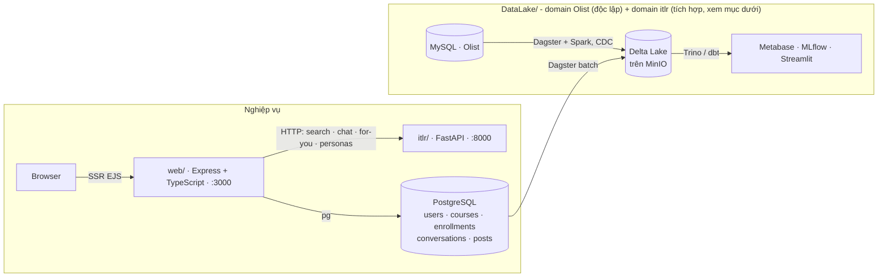

<div align="center">

# IT Learning Recommender System

**Recommender đo bằng phương pháp luận khoa học · Chatbot RAG có cổng kiểm soát · Data Lakehouse
tích hợp thật với dữ liệu nền tảng học tập**

[](itlr)
[](itlr/api)
[](web)
[](web/src/db)
[](docker-compose.yml)
[](DataLake)
[](.github/workflows)
[](LICENSE)

Hệ thống gợi ý khóa học & tài liệu học tập CNTT bằng tiếng Việt. Nguyên tắc viết README này: mọi
con số đều đo được và tái lập được (`scripts/eval/run_all.py`), mọi claim đều kèm cách đo hoặc nói
rõ giới hạn - không có mục nào chỉ liệt kê tên công nghệ mà không kèm bằng chứng nó giải quyết
được gì.

</div>

<br>

| Chỉ số | Kết quả | Đo bằng |
|---|---|---|
| Collaborative Filtering vs popularity baseline | HitRate@10 **0.611 vs 0.043** (×14) | leave-one-out + temporal split không rò rỉ |
| Learning-to-Rank vs Cross-Encoder rerank | Không khác biệt có ý nghĩa thống kê (p > 0.3), nhanh hơn **~74×** khi serving | paired bootstrap, p50 132ms vs 9.76s |
| Cổng off-topic của chatbot | AUC (ROC) **0.99** | tập test 40 câu |
| Off-policy evaluation (SNIPS/DR) | CI 95% phủ đúng giá trị thật, naive lệch **−0.076** | mô phỏng bandit ground-truth |
| DataLake - phân loại cảm xúc review | Accuracy **0.90** | 8.196 review giữ lại kiểm thử |

<br>

## Mục lục

- [Quyết định kỹ thuật đáng chú ý](#quyết-định-kỹ-thuật-đáng-chú-ý)
- [Kiến trúc](#kiến-trúc)
- [Tích hợp hệ thống thực tế](#tích-hợp-hệ-thống-thực-tế)
- [Đánh giá khoa học](#đánh-giá-khoa-học)
- [Tech stack](#tech-stack)
- [Cấu trúc thư mục](#cấu-trúc-thư-mục)
- [Cách chạy](#cách-chạy)
- [Thuật toán](#thuật-toán)
- [Data Engineering - DataLake](#data-engineering---datalake)
- [Giới hạn đã biết - tổng hợp](#giới-hạn-đã-biết---tổng-hợp)
- [CI/CD](#cicd)
- [Tác giả](#tác-giả)
- [Giấy phép](#giấy-phép)

---

## Quyết định kỹ thuật đáng chú ý

Thay vì liệt kê công nghệ đã dùng, đây là các quyết định có đánh đổi thật - mỗi quyết định kèm số
đo đằng sau nó, không phải chọn vì "mới hơn" hay "nghe hay hơn":

- **Learning-to-Rank thay Cross-Encoder cho production**: đo cho thấy 2 cách không khác biệt có ý
  nghĩa thống kê (p > 0.3, cả truy vấn sạch lẫn nhiễu) nhưng LTR nhanh hơn ~74× khi serving (p50
  132ms vs 9.76s). Chọn LTR vì latency, không phải vì cross-encoder "kém".
- **TF-IDF vẫn là baseline mặc định, không phải embeddings**: benchmark 12 truy vấn ban đầu cho
  embeddings thắng - mở rộng lên 40 truy vấn thì **TF-IDF thắng lại**, không cấu hình nào khác
  biệt có ý nghĩa thống kê. Kết luận: benchmark nhỏ ban đầu under-powered, giữ TF-IDF mặc định
  cho tới khi có đủ dữ liệu nhãn để kết luận chắc chắn hơn - không vội chuyển sang cái "hiện đại
  hơn" chỉ vì tên nghe hay.
- **Cổng off-topic chạy trước khi gọi LLM**: chặn câu hỏi ngoài phạm vi IT trước khi tốn token -
  AUC 0.99 đo trên tập test tách riêng, ranh giới rõ giữa "lọc được câu rõ ràng lạc đề" và "hiểu
  hết mọi câu hỏi", không thổi phồng thành cái sau.
- **Batch qua Dagster thay vì CDC mới khi tích hợp DataLake với dữ liệu nền tảng học tập**: domain
  Olist gốc đã có CDC (Kafka/Debezium) chứng minh năng lực đó; khi thêm domain `itlr` nối vào
  Postgres của `web/`, chọn batch - vì CDC thêm độ phức tạp vận hành (replication slot, schema
  drift, exactly-once) không tương xứng lợi ích ở quy mô một dự án portfolio. Không phải không
  biết làm CDC, mà là biết khi nào KHÔNG nên dùng nó.
- **Không xây star schema đầy đủ cho domain tích hợp mới**: Gold layer của domain `itlr` chỉ có
  một fact table gọn (`gold.itlr_fact_interaction`), không có `dim_user`/`dim_course`/`dim_date`
  riêng - domain này chỉ có một loại sự kiện và một trục cắt hữu ích (category), xây dimensional
  model đầy đủ là chi phí kỹ thuật không ai thu hồi lại được.
- **Tách domain bằng `group_name`, không sửa trực tiếp pipeline đang chạy**: thêm domain `itlr`
  vào `DataLake/` bằng file mới + `group_name` riêng (`itlr_bronze`/`itlr_silver`/`itlr_gold`) -
  job `reload_data` (Olist) không hề bị ảnh hưởng, có test khẳng định điều đó (xem phần tích hợp
  bên dưới).

---

## Kiến trúc



- **`itlr/`** (Python) - engine gợi ý + chatbot RAG. Không có UI riêng ngoài trang demo tối giản;
  `web/` là giao diện chính người dùng thấy.
- **`web/`** (Express + TypeScript + PostgreSQL) - auth, catalog, tiến độ học, mạng xã hội học
  tập (bài viết/bình luận/kết bạn/nhắn tin realtime qua SSE), chatbot streaming, trang admin.
- **`DataLake/`** - data lakehouse (Dagster + Spark + Delta Lake + MinIO + Hive Metastore + Trino
  + dbt + MLflow + Streamlit). Domain Olist (CDC qua Kafka/Debezium) vẫn chạy độc lập trên dữ
  liệu e-commerce công khai; domain `itlr` mới nối trực tiếp vào Postgres của `web/`. Xem
  [DataLake/README.md](DataLake/README.md).

---

## Tích hợp hệ thống thực tế

`DataLake/` không còn là demo tách biệt hoàn toàn khỏi phần nghiệp vụ. Domain `itlr` kéo dữ liệu
thật của nền tảng học tập từ Postgres của `web/` qua Bronze layer - tách bạch hoàn toàn với domain
Olist gốc (không sửa file nào của pipeline Olist).

**Đã verify bằng dữ liệu thật, không phải mock:**

- Domain `itlr` trong Dagster kéo trực tiếp 4 bảng Postgres thật của `web/` (`courses`,
  `enrollments`, `lesson_progress`, `lessons`) qua Bronze layer - chạy thành công trên Postgres
  của nền tảng học tập thật.
- Trong lúc chạy thật, lộ ra và vá 2 bug **chỉ xuất hiện khi chạy trên dữ liệu/hạ tầng thật**,
  không phải bug lý thuyết: (1) sai giá trị mật khẩu do đoán theo default thay vì đọc đúng
  `.env` của máy; (2) dấu `;` cuối câu SQL làm backend connectorx-Postgres lỗi cú pháp trong khi
  backend connectorx-MySQL lại chấp nhận - sửa 1 dòng trong factory dùng chung cho cả 2 domain
  (`_bronze_asset`), không phải patch riêng từng chỗ.
- Kết nối Postgres từ Docker network của Dagster qua biến môi trường (`ITLR_PG_*`, tách hẳn khỏi
  `POSTGRES_*` nội bộ của Dagster để tránh xung đột) - tái dùng đúng pattern `host.docker.internal`
  mà `recommender` đã dùng để gọi Ollama, không phải giải pháp mới.
- 12/12 unit test pass, gồm test khẳng định job `reload_data` (Olist) không bị ảnh hưởng khi thêm
  domain `itlr` - tách domain bằng `group_name`, không sửa selection logic cũ.

---

## Đánh giá khoa học

Khung đánh giá (`itlr/eval/` + `scripts/eval/`) đo bằng metric chuẩn ngành (NDCG/MAP/MRR/HitRate),
kiểm định thống kê (paired bootstrap + t-test), và off-policy evaluation - thay vì chỉ nhận xét
định tính. Tái lập toàn bộ: `python scripts/eval/run_all.py`.

### Kết quả vững chắc, đã kiểm định

- **Collaborative Filtering** vượt xa popularity baseline: HitRate@10 **0.611 vs 0.043** (×14),
  đo bằng leave-one-out + temporal split **không rò rỉ** (train lại item-similarity chỉ trên
  phần quá khứ) - NDCG@10 temporal 0.274.
- **Off-policy evaluation** (Doubly Robust/SNIPS) trên mô phỏng bandit ground-truth: CI 95% của
  SNIPS/DR **phủ đúng** giá trị thật của policy mới, trong khi ước lượng naive (CTR quan sát)
  lệch **−0.076** - chứng minh estimator không thiên lệch trước khi có log click thật.
- **Learning-to-Rank** (LightGBM lambdarank) đạt chất lượng **ngang heuristic chỉnh tay** (không
  khác biệt có ý nghĩa thống kê, p > 0.3 trên cả truy vấn sạch lẫn nhiễu) nhưng nhanh hơn
  Cross-Encoder **~74×** khi serving (p50 132ms vs 9.76s).
- **Cổng off-topic** của chatbot: AUC (ROC) **0.99** trên bộ test 40 câu.

### Phát hiện trung thực - không đứng vững khi tăng cỡ mẫu

Luận điểm "embeddings ngữ nghĩa vượt lexical" chỉ đúng trên benchmark nhỏ (12 truy vấn, NDCG@10
embeddings 0.176 vs TF-IDF 0.103) - khi mở rộng lên 40 truy vấn, **TF-IDF vượt lại embeddings**
(0.186 vs 0.171, không có cấu hình nào khác biệt có ý nghĩa thống kê). Tương tự với benchmark
nhiễu (bỏ dấu/lỗi gõ): 10 truy vấn cho hybrid embeddings thắng (p=0.047), nhưng 46 truy vấn thì
**BM25 lexical vượt lại** (0.161 vs 0.120). Kết luận trung thực: các benchmark nhỏ ban đầu
**under-powered**, không đủ để khẳng định ngữ nghĩa thắng lexical trên catalog hiện tại.

Tương tự, độ đồng thuận nhãn tự động vs người gán (Cohen's Kappa) là **0.60 ("vừa") trên catalog
synthetic** nhưng chỉ **0.11 ("yếu") trên catalog dữ liệu thật** - quy trình sinh nhãn tự động cần
cải thiện đáng kể trước khi dùng làm ground-truth chính thức.

---

## Tech stack

Bảng tham chiếu - chi tiết *vì sao* chọn từng thứ nằm ở mục [Quyết định kỹ thuật](#quyết-định-kỹ-thuật-đáng-chú-ý)
và [Tích hợp hệ thống thực tế](#tích-hợp-hệ-thống-thực-tế) ở trên, không lặp lại ở đây.

| Tầng | Công nghệ |
|---|---|
| ML / Retrieval | scikit-learn (TF-IDF) · rank_bm25 · sentence-transformers (embeddings + Cross-Encoder) · FAISS (ANN) · LightGBM (Learning-to-Rank) |
| Chatbot | RAG-Fusion + MMR, cổng off-topic, LLM đa nhà cung cấp (OpenAI → Ollama → tổng hợp offline) |
| API | FastAPI (Python 3.10+) |
| Web app | Express + TypeScript, EJS (SSR), PostgreSQL |
| Đánh giá | numpy thuần - NDCG/MAP/MRR, bootstrap + t-test, Cohen's Kappa, off-policy IPS/SNIPS/DR |
| CI/CD | GitHub Actions - quality gate Python+Node+DataLake, CodeQL, Trivy, zizmor, dependency-review, deploy SSH |
| Data pipeline (`DataLake/`) | Dagster, Spark, Delta Lake, MinIO, Hive Metastore, Trino, dbt, Kafka/Debezium, MLflow, Streamlit |
| Triển khai | Docker Compose (web + recommender + PostgreSQL), VPS tự host qua SSH - quy mô dev/demo, không phải hạ tầng multi-node HA |

---

## Cấu trúc thư mục

```
itlr/                    # Package Python chính
├── core/                 # recommender.py (hybrid scoring), pipeline.py (phễu 4 tầng),
│                         #   embeddings.py, ann.py (FAISS), rerank.py (Cross-Encoder), rag.py
├── chatbot/              # chatbot.py (EducationalChatbot), intent_router.py,
│                         #   knowledge_base.py, query_understanding.py, data/it_glossary.json
├── eval/                  # Khung đánh giá: metrics · diversity · significance · cf_eval ·
│                         #   off_policy · ltr_features (dùng bởi scripts/eval/)
├── pipelines/             # build_model.py · build_embeddings.py · build_cf.py
├── data/                  # generate_items.py · generate_interactions.py
└── api/                   # server.py (FastAPI) - /api/search · /api/chat · /health · /metrics

scripts/
├── build_all.py           # chạy toàn bộ pipeline build artifacts đúng thứ tự
├── eval/                  # CLI thực nghiệm - mỗi script sinh 1 báo cáo (xem §Đánh giá)
└── scrape/                # cào dữ liệu IT thật (Viblo/Dev.to/freeCodeCamp)

web/                      # Web app nghiệp vụ (Express + TS + PostgreSQL)
└── src/
    ├── server.ts · config/ · db/ (schema.sql, pool.ts)
    ├── routes/            # auth · pages (SSR) · api (chat/search) · social · admin
    ├── services/          # recommender.ts (client gọi itlr/), markdown.ts, realtime.ts (SSE)
    └── middleware/         # auth (JWT cookie httpOnly), security (helmet/CSP/rate-limit)

var/                      # artifacts/data build ra (gitignored) - build_all.py sinh lại được
tests/                    # pytest - pure-function tests, không cần engine/embeddings
.github/workflows/         # ci.yml · cd.yml · eval.yml · reusable-{node,python,datalake}-ci.yml
DataLake/                 # Data lakehouse: domain Olist (Dagster/Spark/dbt/Trino) + domain itlr
```

---

## Cách chạy

### Dev thường (không Docker)

```bash
python -m venv .venv && .venv\Scripts\activate   # Linux/Mac: source .venv/bin/activate
pip install -r requirements.txt
python scripts/build_all.py                        # build artifacts (generate → model → embeddings → cf)
python -m uvicorn itlr.api.server:app --port 8000  # recommender (:8000)

# terminal khác:
cd web && npm install
cp .env.example .env                             # sửa DATABASE_URL cho khớp Postgres máy bạn
npm run migrate && npm run seed                  # tạo bảng + nạp catalog từ CSV
npm run dev                                       # web app (:3000)
```

Mở `http://localhost:3000`.

### Docker (một lệnh)

```bash
python scripts/build_all.py                      # cần artifacts sẵn trước khi build image
cp .env.docker.example .env                      # sửa POSTGRES_PASSWORD, JWT_SECRET, SMTP...
docker compose up -d --build
docker compose logs -f web recommender           # theo dõi tiến trình
```

`web` tự migrate + seed khi khởi động; `recommender` cần ~30–90s để nạp model lần đầu. Xem
`docker compose ps` để kiểm tra health, `docker compose down -v` để dừng và xóa dữ liệu.

### Dữ liệu & bảo mật - vì sao repo không kèm sẵn dữ liệu

Repo **không commit** các nhóm sau, vì lý do khác nhau chứ không gộp chung là "giấu":

| Loại | Lý do | Nằm ở |
|---|---|---|
| Secrets thật (mật khẩu DB, `JWT_SECRET`, API key) | Bảo mật - lộ ra là dùng được ngay | `.env`, `web/.env` (chỉ có file `.example` làm mẫu được commit) |
| Dữ liệu người dùng thật (email, tin nhắn, bài đăng khi có người dùng thật dùng web) | Quyền riêng tư - dữ liệu cá nhân thật, không bao giờ export/dump | Postgres container, không có file nào trong repo |
| Model artifacts đã build (`var/`) + báo cáo eval (`reports/`) | Không bí mật, chỉ là build output sinh lại được - commit vào sẽ làm repo phình to vô ích | sinh lại bằng script bên dưới |
| Dataset Olist CSV (~120MB, `DataLake/dataset/`) | Dataset công khai của bên thứ ba (Kaggle) - tự tải theo license của họ, không phải của mình để commit | xem `DataLake/README.md` mục Dataset |

**Từng bị lộ và đã vá**: có lúc `.env` (chứa mật khẩu Postgres + `JWT_SECRET` thật) bị lỡ commit vào
git dù chính file đó tự ghi "KHÔNG commit". Đã gỡ khỏi tracking và bổ sung `.gitignore` - nếu bạn
clone bản cũ hơn, nên đổi `POSTGRES_PASSWORD`/`JWT_SECRET` trong `.env` của mình thay vì tái sử
dụng giá trị cũ.

### Muốn tự chạy thử - không cần xin dữ liệu của tác giả

Toàn bộ dữ liệu để chạy demo (catalog khóa học, tương tác người dùng cho CF) đều **sinh lại được
từ script có sẵn**, không phụ thuộc file riêng nào của tác giả:

```bash
python scripts/build_all.py          # sinh catalog + train model + embeddings + CF từ đầu
cp .env.docker.example .env          # tự điền POSTGRES_PASSWORD/JWT_SECRET của RIÊNG bạn
docker compose up -d --build         # web tự migrate + seed từ catalog vừa sinh
```

Xong là có một bản demo đầy đủ chức năng (search, chatbot, "Dành cho bạn"), dữ liệu 100% sinh
trên máy bạn, không đụng gì tới dữ liệu/tài khoản thật của tác giả. Muốn test luôn `DataLake/`
(lakehouse) thì tự tải dataset Olist từ Kaggle theo hướng dẫn ở `DataLake/README.md` - dataset đó
công khai, không cần xin ai.

---

## Thuật toán

1. **Hybrid scoring**: `65% TF-IDF cosine + 25% cùng chuyên mục + 10% chủ đề trùng (Jaccard)`.
2. **Phễu xếp hạng 4 tầng** (`itlr/core/pipeline.py`, bật/tắt độc lập từng tầng):
   `Stage 0` Candidate Generation (embeddings + FAISS ANN, hoặc BM25/TF-IDF) →
   `Stage 1` L1 ranking nhẹ (hybrid score) →
   `Stage 2` L2 re-ranking nặng (Cross-Encoder **hoặc** Learning-to-Rank) →
   `Stage 3` Re-ordering (MMR đa dạng hóa).
3. **Chatbot**: RAG-Fusion (multi-query + Reciprocal Rank Fusion) + cổng off-topic trước khi vào
   LLM; sinh câu trả lời qua OpenAI → Ollama cục bộ → tổng hợp offline nếu không có key nào.
4. **Collaborative Filtering** item-based cho gợi ý "Dành cho bạn".

---

## Data Engineering - DataLake

`DataLake/` là một **Data Lakehouse** containerized, có 2 domain tách bạch:

- **Domain Olist** (gốc, độc lập hoàn toàn) - trên bộ dữ liệu e-commerce công khai
  [Olist](https://www.kaggle.com/datasets/olistbr/brazilian-ecommerce) (~100k đơn hàng, 9 bảng
  quan hệ), tự vận hành nguồn MySQL + dataset riêng, không đọc gì từ `web/`/`itlr/`.
- **Domain `itlr`** (mới, tích hợp) - nối trực tiếp vào Postgres của nền tảng học tập thật
  (`web/`). Xem mục [Tích hợp hệ thống thực tế](#tích-hợp-hệ-thống-thực-tế).

Năng lực Data Engineering thể hiện qua domain Olist:

- **Kiến trúc Medallion** (Bronze → Silver → Gold → Platinum) trên Delta Lake/MinIO, orchestrate
  bằng **Dagster**, xử lý bằng **Apache Spark**.
- **CDC streaming**: **Kafka + Debezium** bắt mọi insert/update/delete từ binlog MySQL, 2 job Spark
  Structured Streaming đổ vào Bronze exactly-once (checkpoint trên MinIO).
- **Truy vấn SQL tương tác** qua **Trino** trên toàn bộ lake (qua Hive Metastore), transform lớp
  Platinum bằng **dbt** kèm schema test.
- **Machine Learning**: phân loại cảm xúc review khách hàng (TF-IDF + Logistic Regression), tracked
  bằng **MLflow**, accuracy **0.90** trên 8.196 review giữ lại kiểm thử; phục vụ qua app **Streamlit**.
- **Data quality**: Dagster asset checks (khóa null, giá trị âm) chạy trực tiếp trong Dagster UI;
  unit test cho pipeline ML chạy trong CI mỗi lần push.
- **BI**: dashboard **Metabase** trên lớp Platinum.

Chi tiết đầy đủ (kiến trúc, quick start, service endpoints, roadmap): [DataLake/README.md](DataLake/README.md).

---

## Giới hạn đã biết - tổng hợp

Gom hết vào một chỗ để dễ soi, thay vì rải rác - đây là những gì CHƯA đúng như một hệ thống
production hoàn chỉnh, nói thẳng thay vì để người đọc tự phát hiện:

- **Tương tác người dùng cho CF vẫn chủ yếu là mô phỏng** (latent-factor simulation, không phải
  log hành vi thật) - khung off-policy/CF đã sẵn sàng nhận dữ liệu thật ngay khi có.
- **Không có GPU** - mọi benchmark latency đo trên CPU 1 luồng; số liệu latency không đại diện cho
  môi trường có GPU.
- **Hạ tầng Docker Compose là quy mô dev/demo**, không phải production đa node: mọi service trong
  `DataLake/` chạy single-node (1 Spark worker, 1 Hive Metastore, 1 Trino, 1 MinIO), không có HA/DR,
  secrets nằm trong `.env` chứ không qua secrets manager. Phù hợp để chứng minh hiểu kiến trúc,
  chưa phù hợp để triển khai thẳng vào môi trường doanh nghiệp cần multi-tenant/governance/scale.
- **Benchmark bán ngữ nghĩa vs lexical còn under-powered** ở một số cấu hình (chi tiết ở mục
  Đánh giá khoa học) - kết luận hiện tại có thể đổi khi có thêm truy vấn/nhãn.

---

## CI/CD

Toàn bộ pipeline chạy trên **GitHub Actions** (`.github/workflows/`), tách 3 quality gate độc lập
theo dịch vụ và tái sử dụng qua `workflow_call`:

- **`ci.yml`** (mọi PR + push nhánh phụ) - chạy song song:
  - `reusable-python-ci.yml` - ruff + pytest cho `itlr/`
  - `reusable-node-ci.yml` - eslint + tsc + vitest cho `web/`
  - `reusable-datalake-ci.yml` - ruff + pytest cho `DataLake/etl_pipeline`
  - **CodeQL** (JavaScript/TypeScript + Python) - quét lỗ hổng bảo mật tĩnh
  - **Trivy** filesystem scan - CVE trong dependency, fail nếu HIGH/CRITICAL chưa vá
  - **dependency-review** - chặn PR thêm dependency có lỗ hổng đã biết
  - **zizmor** - tự lint workflow của chính repo (template injection, permission quá rộng,
    action chưa pin theo SHA)
  - Lint PR title theo Conventional Commits (`amannn/action-semantic-pull-request`)
- **`cd.yml`** (push `main`) - chờ quality gate Python + Node xanh, sau đó SSH vào VPS, `git pull`
  và `docker compose up -d --build` để deploy.
- **`eval.yml`** - smoke-test riêng cho khung đánh giá khoa học (`itlr/eval/`).

Toàn bộ Actions bên thứ ba đều **pin theo SHA** (không dùng tag di động), permission theo nguyên
tắc tối thiểu (`contents: read` mặc định, chỉ mở thêm khi job thật sự cần).

---

## Tác giả

<div align="center">

**Tào Việt Đức**

taovietduc.work@gmail.com

Thiết kế và triển khai toàn bộ hệ thống: kiến trúc backend/ML (`itlr/`), web app full-stack
(`web/`), data lakehouse (`DataLake/`), khung đánh giá khoa học, và pipeline CI/CD.

</div>

---

## Giấy phép

**Bản quyền © 2026 Tào Việt Đức. Bảo lưu mọi quyền (All rights reserved).**

Đây **không phải mã nguồn mở** - xem đầy đủ điều khoản tại [LICENSE](LICENSE). Được phép đọc mã
nguồn để tham khảo cá nhân/học tập; **không được** sao chép, phát hành lại, nhận là tác phẩm của
mình, hay dùng cho mục đích thương mại nếu chưa có sự cho phép bằng văn bản từ tác giả.
