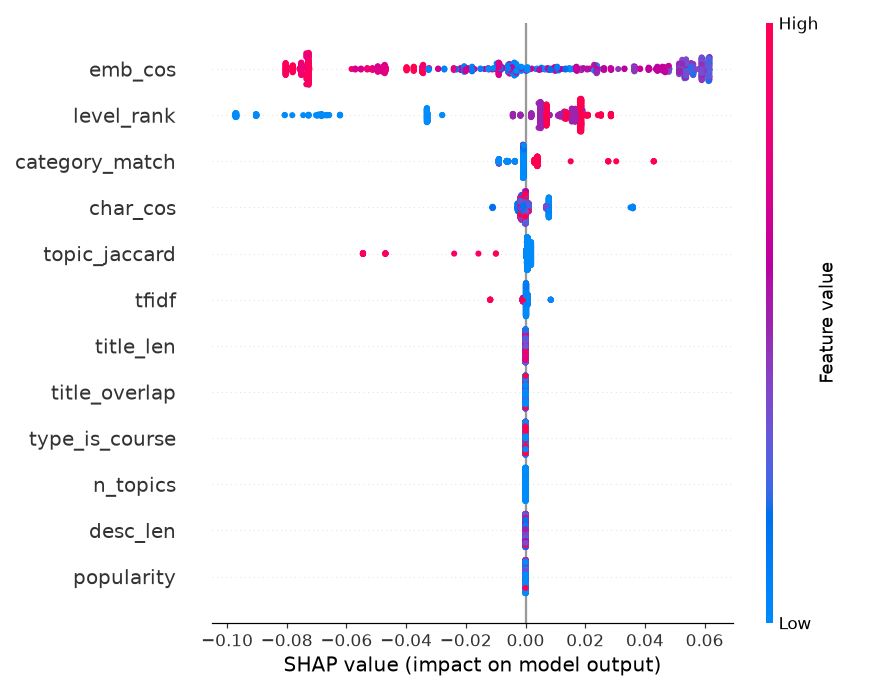
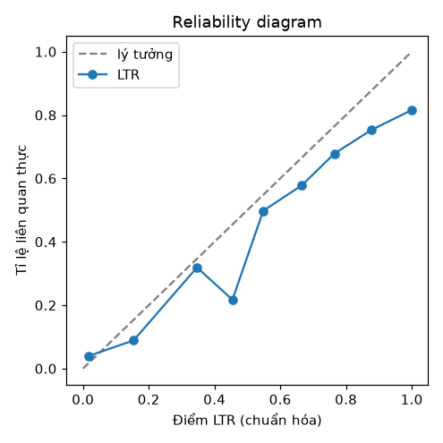

# Learning-to-Rank (Trụ cột C)

- LightGBM lambdarank | 15 đặc trưng | best_iter=1 | valid NDCG@10=0.9397
- Train 35 truy vấn / Test 11 truy vấn (held-out)

## LTR vs Heuristic chỉnh tay — NDCG@10 trên test held-out

| Chế độ truy vấn | Heuristic | LTR | Δ (LTR−Heur) | p (t-test) | Có ý nghĩa? |
|---|---|---|---|---|---|
| Sạch | 0.0728 | 0.0775 | +0.0047 | 0.7923 | — |
| Nhiễu (bỏ dấu) | 0.0000 | 0.0123 | +0.0123 | 0.3409 | — |

## Đặc trưng quan trọng (gain) — top
- `emb_cos`: 73
- `level_rank`: 41
- `category_match`: 4
- `topic_jaccard`: 3
- `tfidf`: 1
- `char_cos`: 0
- `bm25`: 0
- `cross_enc`: 0

  

### Diễn giải trung thực
- Trên benchmark **synthetic này, nhãn ≈ khớp topic chính xác**, và heuristic L1 (`topic_jaccard`/`containment`) được **chỉnh tay đúng vào luật sinh nhãn** -> đạt **trần NDCG@10≈1.0 (sạch)**, nên LTR gần như không thể vượt trên tập sạch (so sánh bị chặn trần).
- Phép so sánh có ý nghĩa hơn là **truy vấn nhiễu**: LTR và heuristic **không khác biệt có ý nghĩa thống kê** (xem cột p) — tức LTR **học lại được chất lượng của trọng số chuyên gia THUẦN TỪ DỮ LIỆU, không cần chỉnh tay**.
- **Đóng góp của LTR** vì vậy là **phương pháp luận**: (1) thay heuristic cảm tính bằng hàm xếp hạng học được + hard-negative mining; (2) **giải thích được** (SHAP — tín hiệu nào quan trọng); (3) **điểm được hiệu chỉnh** (reliability diagram). Trên **dữ liệu thật** (Trụ cột I) nơi liên quan KHÔNG phải một luật đơn giản, cách tiếp cận học-từ-dữ-liệu được kỳ vọng vượt heuristic — đây là hướng kiểm chứng tiếp theo.
- Đặc trưng cross-encoder (mặc định BẬT; chạy không `--no-cross`) bổ sung tín hiệu ngữ nghĩa cặp đôi mạnh cho LTR.